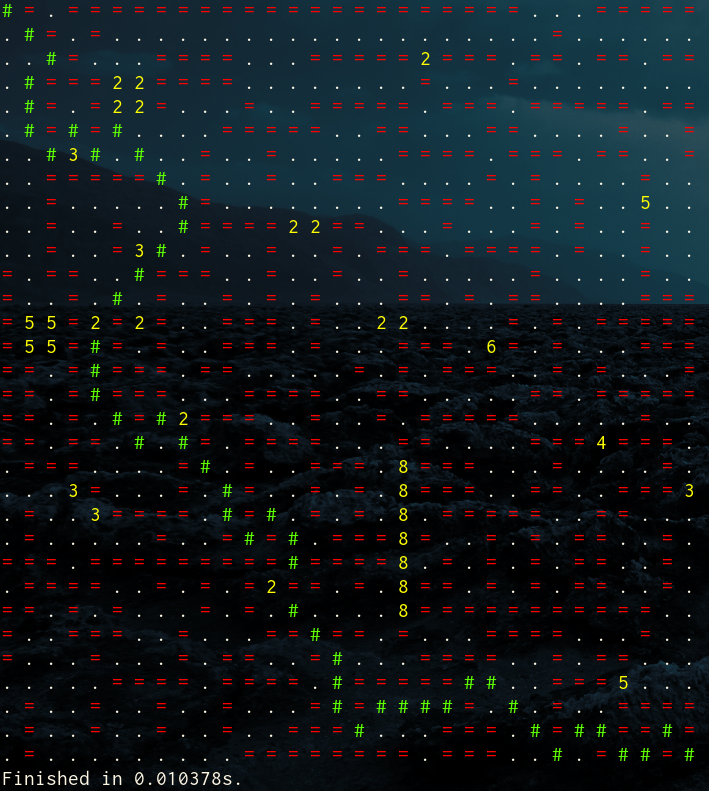

## ASCII A* search

This project is a simple demonstration of the A* search algorithm implemented in Python 3.4. The A* search algorithm is an extension of Dijkstra's algorithm that adds a heuristic function to prioritize the visiting of nodes that are in the general direction of the goal. It is commonly used to implement path finding in games.

#### How the algorithm works

The A* search algorithm represents each location that can be traveled to and from as a **node**. 
Nodes can point to any number of other nodes, known as **neighbors**.  A network of nodes collectively forms a graph. 
In this demo implementation, a graph is a 32x32 grid of nodes, each able to refer to its above, below, left, right and diagonal neighbors.

This implementation uses a priority queue known as the **frontier**.
Initially only the predefined starting node in the upper left corner of the grid is in the frontier.
The algorithm loops until the frontier is empty (i.e. it contains no nodes).
In that loop, the node with the lowest priority value is selected and its neighbors are iterated over.

The algorithm then proceeds to assign the neighbor node currently being iterated over a new cost value, which is the current node's cost value plus the weight of the node itself. The final priority value for the neighbor node is calculated using the new cost previously calculated and a **heuristic** function.
The heuristic function estimates distance to the goal node. In this demo implementation, [Chebychev distance](https://en.wikipedia.org/wiki/Chebyshev_distance) is used instead of [Manhattan distance](https://en.wiktionary.org/wiki/Manhattan_distance) as it takes into account diagonal distance.

Finally, the neighboring node is assigned its priority and cost and is added to the frontier.
An important note is that neighbor nodes are only added to the frontier if they either haven't already been evaluated or the new calculated cost is lower than the previously assigned cost.
In addition to cost and priority, the parent node of each evaluated node is also stored. This is used to reconstruct the path once the current node is equal to the goal node.

#### Writing custom graphs

It is possible to create custom graphs to be used in this demo. Edit the template file: `predef_graphs/template`. Nodes with a weight of 1 are represented with a period (`.`); nodes with a different weight can be represented as a single digit number (`1-9`); obstacles which cannot be passed through are equal-signs (`=`). Ensure that there are no additional new-lines or spaces before saving the file.
 
### Psuedo-code and reference

The psuedo-code used to implement this demo as well as a nice interactive tutorial that explains the A* search algorithm much better than my explanation given above can be found [here](http://www.redblobgames.com/pathfinding/a-star/introduction.html).
